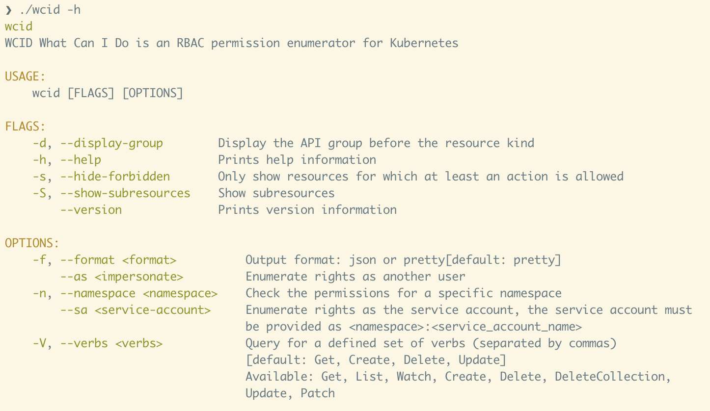

# WCID: What Can I Do?

This project is a learning exercise to use the [Kubernetes](http://kubernetes.io/) API in [Rust](https://www.rust-lang.org/fr).

It will show you what the current user (from kubeconfig or service account) can
do with the K8s cluster.

## Usage

## Example

## Credits

Inspired by [rakkess](https://github.com/corneliusweig/rakkess)
